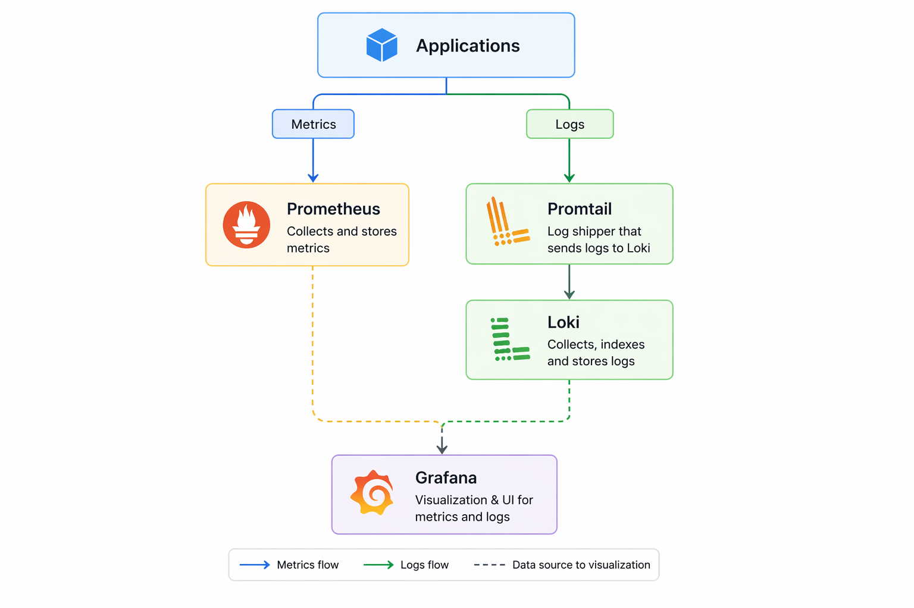
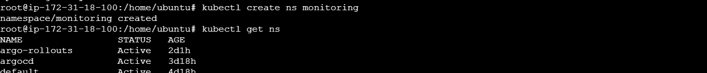
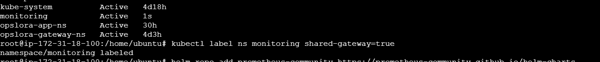
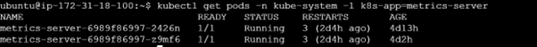
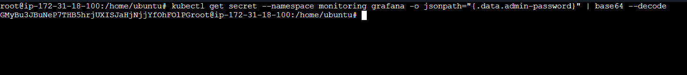
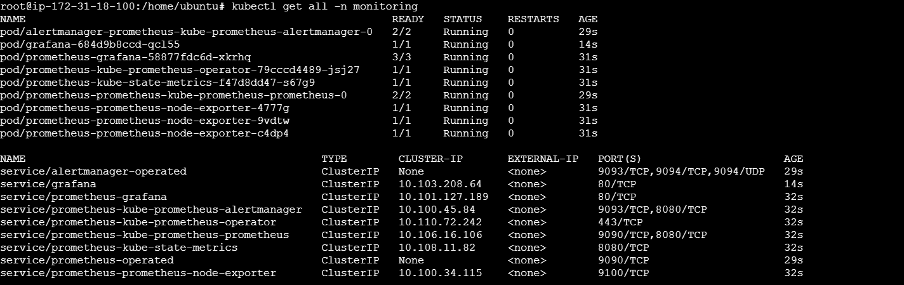
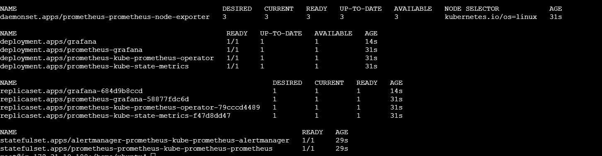
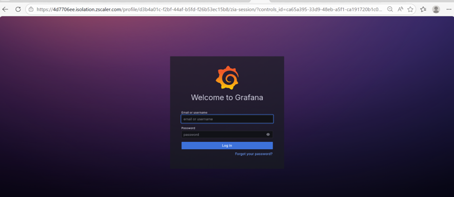
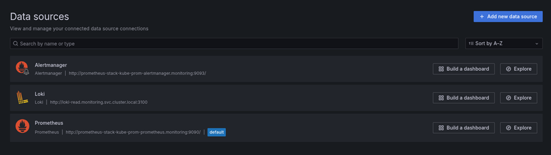
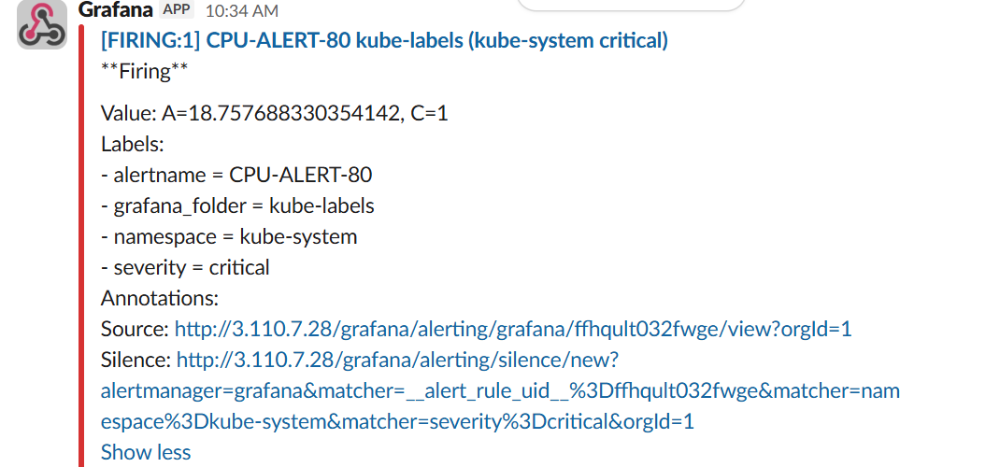

# Monitoring
## Introduction 
In a microservices-based architecture running on Kubernetes, applications are no longer a single unit. Instead, they are composed of multiple loosely coupled services running across different nodes and environments.
Because of this complexity, it becomes impossible to rely on manual observation or simple logs to understand system behavior.
This is where monitoring and logging become critical.
Monitoring is the process of collecting, analyzing, and visualizing numerical data (metrics) about your system over time.
These metrics include:
-	CPU usage, Memory consumption, Request rates, Error rates, Pod restarts, Network traffic
Logging is the process of recording detailed events or messages generated by applications and systems.
Logs typically include:
-	Error messages, Debug information, Transaction details, Application flow 

## Observability
It is the ability to understand the internal state of a system by analyzing its outputs. It combines: \
•	Metrics (Prometheus) \
•	Logs (Loki) \
•	Visualization (Grafana) 

### Why Observability Matters
In distributed systems: \
•	Failures are unpredictable \
•	Issues span across multiple services \
•	Root cause is not obvious 
### Observability helps you:
•	Detect problems early \
•	Debug faster \
•	Reduce downtime \
•	Improve reliability
| Component   | Purpose                          | Data Type                     |
|------------|----------------------------------|-------------------------------|
| Prometheus | Collects system & app metrics    | Time-series metrics           |
| Loki       | Collects logs                    | Structured / unstructured logs|
| Grafana    | Visualization                    | UI for both metrics & logs    |
| Promtail   | Log shipper                      | Sends logs → Loki             |
<br>
### Prerequisites
#### Infrastructure
•	Kubernetes cluster (on EC2) \
•	Minimum: \
&nbsp;&nbsp;&nbsp;&nbsp;	3 nodes (master + workers) \
&nbsp;&nbsp;&nbsp;&nbsp;	4 CPU / 8GB RAM per node recommended \

#### Permissions
•	Cluster-admin access \
•	Ability to create: \
&nbsp;&nbsp;&nbsp;- CRDs \
&nbsp;&nbsp;&nbsp;- Namespaces \
&nbsp;&nbsp;&nbsp;- LoadBalancer / Gateway routes \
#### Networking 
| Service    | Port |
|------------|------|
| Prometheus | 9090 |
| Grafana    | 3000 |
| Loki       | 3100 |

Ensure:\
•	HAProxy allows inbound traffic \
•	DNS: grafana.opslora.com\
## Step-by-Step Installation:
#### Step 1: Create Namespace
```bash
kubectl create namespace monitoring
```
<br>
Add a label shared-gateway=true for monitoring namespace
```bash
kubectl label ns monitoring shared-gateway=true
```
<br>

### Install Prometheus
#### Prerequisite: Metrics Server Installation
Before installing Prometheus, it is recommended to install the Kubernetes Metrics Server to enable basic resource monitoring and autoscaling capabilities.

#### Metrics Server provides: 
•	Real-time CPU and memory usage of nodes and pods \
•	Support for kubectl top commands \
•	Required metrics for Horizontal Pod Autoscaler (HPA)

### Installation Steps
#### Step 1: Deploy Metrics Server
```bash
kubectl apply -f https://github.com/kubernetes-sigs/metrics-server/releases/latest/download/high-availability-1.21+.yaml
```
#### Step 2: Enable Insecure TLS (Required for EC2 / On-Prem)
```bash
kubectl patch deployment metrics-server -n kube-system --type='json' \
  -p='[{"op": "add", "path": "/spec/template/spec/containers/0/args/-", "value": "--kubelet-insecure-tls"}]'
```
#### Step 3: Verify Installation
```bash
kubectl get pods -n kube-system -l k8s-app=metrics-server
```
<br>

#### Step 4: Validate Metrics
Check Node Metrics
```bash
kubectl top nodes
```
Check Pod Metrics
```bash
kubectl top pods -A
```
### Install Prometheus
```bash
helm repo add prometheus-community \
https://prometheus-community.github.io/helm-charts 
 helm repo update 
 helm install prometheus prometheus-community/kube-prometheus-stack \ 
  --namespace monitoring --create-namespace 
 kubectl get pods -n monitoring 
 kubectl patch svc prometheus-kube-prometheus-prometheus -n monitoring \ 
  -p '{"spec": {"type": "ClusterIP"}}' 
 kubectl get svc -n monitoring 
```
### Install Grafana
```bash
 helm repo add grafana https://grafana.github.io/helm-charts
 helm repo update 
 helm install grafana grafana/grafana --namespace monitoring 
 kubectl get pods -n monitoring 
 kubectl patch svc grafana -n monitoring \ 
  -p '{"spec": {"type": "ClusterIP"}}' 
```

To Get the Password: 
```bash
kubectl get secret --namespace monitoring grafana -o jsonpath="{.data.admin-password}" | base64 –decode
	(Update the password later in Grafana dashboard)
```
<br>

#### Verify Grafana and Prometheus 
```bash
kubectl get all -n monitoring 
```
<br>
<br>

### Install Loki
```bash
helm install loki grafana/loki --namespace monitoring
```
### Install Promtail
```bash
helm install promtail grafana/promtail --namespace monitoring
```

## Exposing via HAProxy + kgateway

#### HTTPRoute for Grafana
```bash
apiVersion: gateway.networking.k8s.io/v1
kind: HTTPRoute
metadata:
  name: grafana-route
  namespace: monitoring
spec:
  parentRefs:
  - name: opslora-gateway
    namespace: opslora-gateway-ns
  hostnames:
  - grafana.opslora.com
  rules:
  - matches:
      - path:
          type: PathPrefix
          value: /
    backendRefs:
      - name: grafana
        port: 80
```
<br>
## Integration of Grafana, Prometheus, and Loki
### Access Grafana UI
Open:
http://grafana.opslora.com

#### Add Prometheus Data Source
&nbsp;1.	Go to:
Connections → Data Sources\
&nbsp;2.	Click:
Add data source\
&nbsp;3.	Select:
Prometheus

#### Configuration
Name: Prometheus\
URL: http://prometheus-kube-prometheus-prometheus.monitoring.svc.cluster.local:9090\
Kubernetes automatically creates DNS names for every service using this format:
```bash
http://<service-name>.<namespace>.svc.cluster.local:<port>
```

#### Add Loki Data Source
&nbsp;1.	Go to:\
&nbsp;&nbsp;&nbsp;&nbsp;&nbsp;&nbsp;Connections → Data Sources → Add data source\
&nbsp;2.	Select:
Loki
#### Configuration
Name: Loki\
URL: http://loki.monitoring.svc.cluster.local:3100\
Kubernetes automatically creates DNS names for every service using this format:
```bash
http://<service-name>.<namespace>.svc.cluster.local:<port>
```

#### Add Alert-Manager Data Source
&nbsp;1.	Go to:\
&nbsp;&nbsp;&nbsp;&nbsp;&nbsp;&nbsp;Connections → Data Sources → Add data source\
&nbsp;2.	Select:
Alertmanager

#### Configuration
Name: Alertmanager\
URL: http://prometheus-stack-kube-prom-alertmanager.monitoring:9093/ \
Kubernetes automatically creates DNS names for every service using this format:
```bash
http://<service-name>.<namespace>.svc.cluster.local:<port>
```
#
<br>

## Slack Setup (Webhook Creation)
### Step 1: Create Slack Channel
Create a channel:\
&nbsp;opslora-alerts
### Step 2: Create Incoming Webhook
&nbsp;1.	Go to Slack:\
&nbsp;&nbsp;&nbsp;&nbsp;&nbsp;Settings → Apps → Manage Apps\
&nbsp;2.	Search:
&nbsp;&nbsp;&nbsp;&nbsp;&nbsp; Incoming Webhooks
&nbsp;3.	Click:\
&nbsp;&nbsp;&nbsp;&nbsp;&nbsp;Add to Slack\
&nbsp;4.	Select channel:\
&nbsp;&nbsp;&nbsp;&nbsp;&nbsp;opslora-alerts\
&nbsp;5.	Click:\
&nbsp;&nbsp;&nbsp;&nbsp;&nbsp;Allow
### Step 3: Copy Webhook URL
Example:
https://hooks.slack.com/services/T000/B000/XXXX

## Configure Slack in Grafana
### Step 1: Go to Alerting
In Grafana:\
&nbsp;&nbsp;Alerting → Contact points
### Step 2: Create Contact Point
&nbsp;1.	Click:\
&nbsp;&nbsp;&nbsp;&nbsp;&nbsp;New contact point\
&nbsp;2.	Name:\
&nbsp;&nbsp;&nbsp;&nbsp;&nbsp;slack-opslora-alerts\
&nbsp;3.	Type:\
&nbsp;&nbsp;&nbsp;&nbsp;&nbsp;Slack

#### Configuration
Webhook URL: https://hooks.slack.com/services/XXX \
Channel: #opslora-alerts

## Create Alert Rule (Grafana)
### Step 1: Go to Alert Rules
&nbsp;&nbsp;&nbsp;&nbsp;&nbsp;Alerting → Alert rules → New alert rule
### Step 2: Define Query (Prometheus)
#### Example:
rate(container_cpu_usage_seconds_total[5m]) > 0.8\
High CPU usage alert

### Step 3: Set Conditions
&nbsp;•	Condition:\
&nbsp;&nbsp;&nbsp;&nbsp;&nbsp;&nbsp;WHEN query > threshold\
&nbsp;•	Duration:\
&nbsp;&nbsp;&nbsp;&nbsp;&nbsp;&nbsp;2m
### Step 4: Add Labels
&nbsp;alertname: CPU-ALERT\
&nbsp;severity: critical
### Step 5: Add Annotations
&nbsp;summary: High CPU usage detected\
&nbsp;description: CPU usage is above 80% for 2 minutes
### Step 6: Assign Contact Point
&nbsp;Select:\
&nbsp;&nbsp;&nbsp;&nbsp;&nbsp;slack-opslora-alerts
### Step 7: Save Rule
<br>


