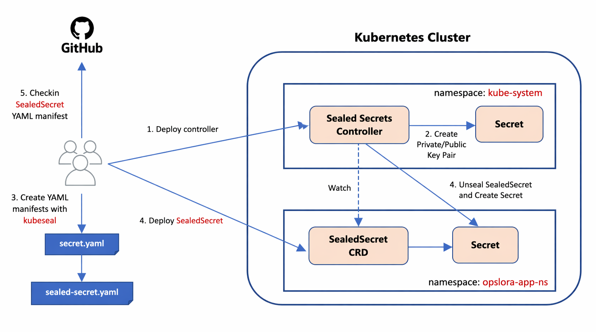
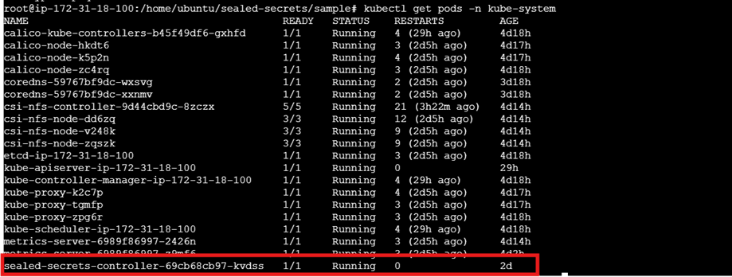
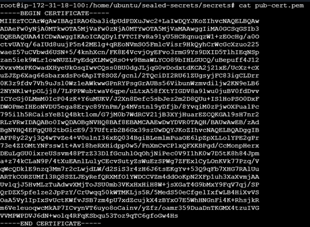
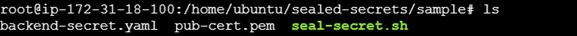
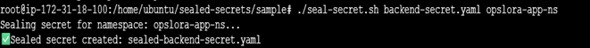
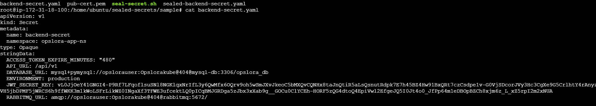
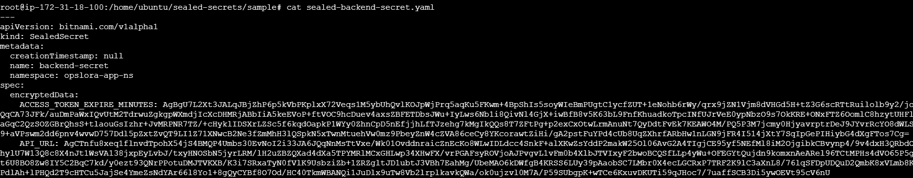
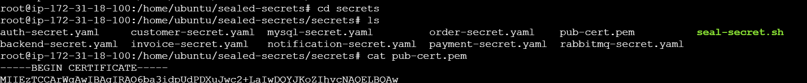
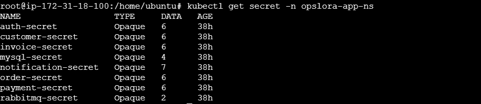

# Sealed Secrets

Sealed Secrets is a Kubernetes solution developed by Bitnami that allows you to:
-	Encrypt secrets into a safe, shareable format
-	 Store them securely in Git
-	Automatically decrypt them inside the cluster

### How Sealed secrets work? 
Developer → kubeseal → SealedSecret (encrypted YAML) → Git

#### Kubernetes Cluster: 
Sealed Secrets Controller → decrypts → creates Secret



### Important Components:

Component&nbsp;&nbsp;&nbsp;&nbsp;&nbsp;&nbsp;&nbsp;&nbsp;&nbsp;&nbsp;&nbsp;&nbsp;&nbsp;&nbsp;&nbsp;&nbsp;&nbsp;&nbsp;&nbsp;&nbsp;&nbsp;&nbsp;&nbsp;&nbsp;&nbsp;&nbsp;&nbsp;&nbsp;&nbsp;&nbsp;&nbsp;&nbsp;&nbsp;&nbsp;&nbsp;&nbsp;Purpose 

Sealed Secrets Controller&nbsp;&nbsp;&nbsp;&nbsp;&nbsp;&nbsp;&nbsp;&nbsp;&nbsp;&nbsp;&nbsp;&nbsp;Runs in cluster, decrypts secrets\
kubeseal CLI&nbsp;&nbsp;&nbsp;&nbsp;&nbsp;&nbsp;&nbsp;&nbsp;&nbsp;&nbsp;&nbsp;&nbsp;&nbsp;&nbsp;&nbsp;&nbsp;&nbsp;&nbsp;&nbsp;&nbsp;&nbsp;&nbsp;&nbsp;&nbsp;&nbsp;&nbsp;&nbsp;&nbsp;&nbsp;&nbsp;Encrypts secrets\
SealedSecret CRD&nbsp;&nbsp;&nbsp;&nbsp;&nbsp;&nbsp;&nbsp;&nbsp;&nbsp;&nbsp;&nbsp;&nbsp;&nbsp;&nbsp;&nbsp;&nbsp;&nbsp;&nbsp;Custom resource for encrypted secrets


### Step-by-Step Installation:
#### Step 1: Install kubeseal CLI
Download the Binary
```bash
wget https://github.com/bitnami-labs/sealed-secrets/releases/download/v0.25.0/kubeseal-0.25.0-linux-amd64.tar.gz
```
Extract the Package
```bash
tar -xvzf kubeseal-0.25.0-linux-amd64.tar.gz
```
Move Binary to System Path
```bash
sudo mv kubeseal /usr/local/bin/
```
Set Execute Permission
```bash
chmod +x /usr/local/bin/kubeseal
```
Verify Installation
```bash
kubeseal –version
```

### Step 2: Install Sealed Secrets Controller
The controller runs inside the Kubernetes cluster and is responsible for:
-	Decrypting Sealed Secrets
-	Creating Kubernetes Secrets\

Apply Controller Manifest
```bash
kubectl apply -f https://github.com/bitnami-labs/sealed-secrets/releases/download/v0.25.0/controller.yaml
```
Verify
```bash
kubectl get pods -n kube-system
```


### Step 3: Get Sealed Secrets Public Key
```bash
kubeseal --fetch-cert \
  --controller-name=sealed-secrets-controller \
  --controller-namespace=kube-system \
  > pub-cert.pem
```


### Step 4: Convert a Kubernetes Secret YAML file into a Sealed Secret YAML file 
	
This script helps to automate the kubeseal command so you don’t have to type everything manually.
#### sealed-secret.sh
```bash
#!/bin/bash
 
# Usage:
# ./seal-secret.sh <secret.yaml> <namespace>
 
SECRET_FILE=$1
NAMESPACE=$2
CERT=pub-cert.pem
 
if [ -z "$SECRET_FILE" ] || [ -z "$NAMESPACE" ]; then
  echo "Usage: ./seal-secret.sh <secret.yaml> <namespace>"
  exit 1
fi
 
if [ ! -f "$CERT" ]; then
  echo "Public cert not found! Run fetch-cert first."
  exit 1
fi
 
echo "Sealing secret for namespace: $NAMESPACE..."
 
kubeseal \
  --format yaml \
  --cert $CERT \
  --namespace $NAMESPACE \
< $SECRET_FILE \
> sealed-$SECRET_FILE
 
echo "✅ Sealed secret created: sealed-$SECRET_FILE"
```

Inside your working directory you should have secret manifests, public key and script for automating.

<br>
```bash
ls
```
Execute Sealing Script
```bash
./seal-secret.sh <secret.yaml> <namespace>
```
<br>

It creates a sealed-<secret.yaml> file which contains the sealed secret\
backend-secret.yaml with kind:Secret contains plain passwords which will be stored as base 64
```bash
cat <secret.yaml>
```
<br>
sealed-backend-secret.yaml contains fully encrypted password which can be decrypted only in that Kubernetes cluster.
```bash
cat <sealed-secret.yaml>
```
<br>
Contains original Kubernetes Secret YAML files
```bash
cd secrets
ls
```
<br>
Contains encrypted secrets
```bash
cd sealed
ls
```
<br>
### Step 5: Apply Sealed Secret
```bash
kubectl apply -f .
```
### Step 6: View the secaled secrets 
```bash
kubectl get secrets -n <namespace>
```
<br>

### Step 7: Controller Decrypts Automatically
#### Inside cluster:
SealedSecret → Sealed Secrets Controller → Secret


